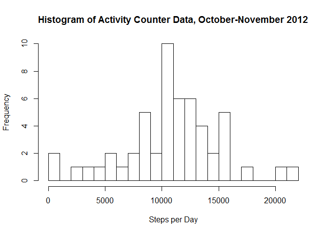
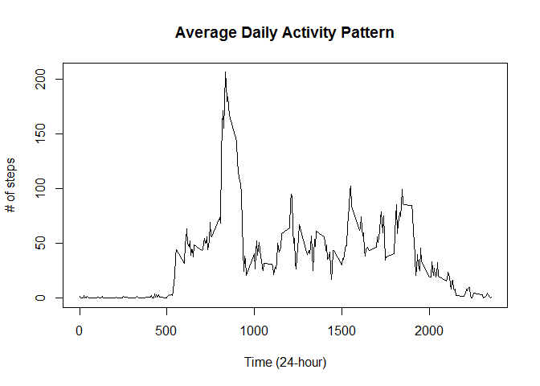
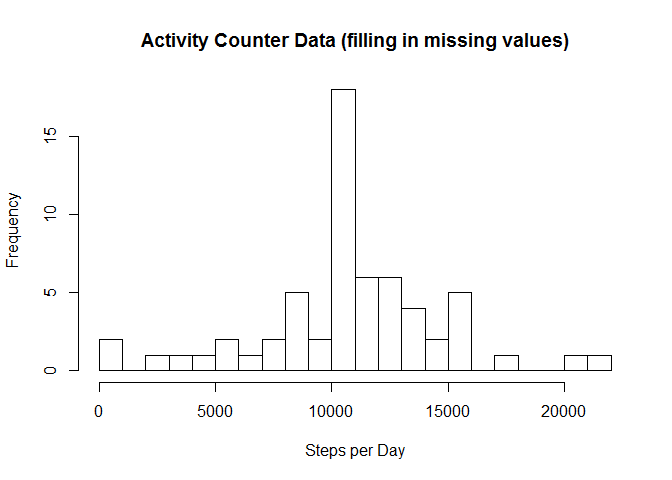
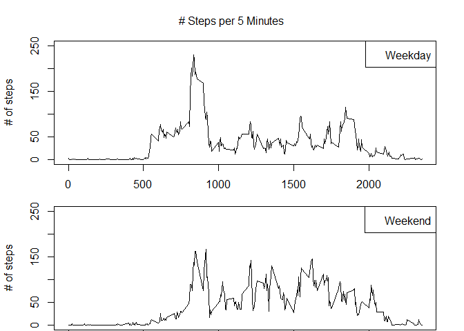

# Reproducible Research: Peer Assessment 1

This study presents a brief analysis of personal movement data from an activity-monitoring device.  The data was downloaded from https://d396qusza40orc.cloudfront.net/repdata%2Fdata%2Factivity.zip at 10:13am on 6/7/15.

## Loading and preprocessing the data

Data was loaded (after selecting the appropriate local directory) and preprocessed (to remove NA values) as follows:


```r
activityRaw <- read.csv("activity.csv")
activity <- na.omit(activityRaw)
```

## What is mean total number of steps taken per day?
Mean and median total steps per day can be observed by aggregating by date:

```r
activityDaySum <- aggregate(activity$steps, by=list(activity$date), FUN=sum)
```
and computing on  the resulting set of daily step counts:

```r
mean(activityDaySum[,2])
```

```
## [1] 10766.19
```

```r
median(activityDaySum[,2])
```

```
## [1] 10765
```
The daily counts occur with the following frequencies:

```r
hist(activityDaySum[,2], breaks = 20, xlab = "Steps per Day", 
     main = "Histogram of Activity Counter Data, October-November 2012")
```

 

## What is the average daily activity pattern?
Aggregating the data by the 5-minute interval time of the day (rather than by date), we obtain a average daily pattern of step counts:

```r
activityPattern <- aggregate(activity$steps, by=list(activity$interval), FUN=mean)
plot(activityPattern$Group.1, activityPattern$x, type="l", main="Average Daily Activity Pattern", 
     xlab="Time (24-hour)", ylab="# of steps")
```

 

The time interval with the highest average step count begins at 8:35AM, with 206.2 steps, as shown here:  

```r
which.max(activityPattern$x)
```

```
## [1] 104
```

```r
activityPattern[104,]
```

```
##     Group.1        x
## 104     835 206.1698
```

## Imputing missing values
To substitute some reasonable values for missing data, first identify the rows of the original unpreprocessed data where NA values occur:

```r
rowIndicesWithNA <- which(is.na(activityRaw$steps))
```
Now for each of those rows, we look up the average value of step counts already computed on  non-NA data for the corresponding time of day:

```r
activityImputed <- activityRaw
for(row in rowIndicesWithNA) {
  interval = activityImputed$interval[row]
  patternRow = match(interval,activityPattern$Group.1)
  activityImputed$steps[row] <- activityPattern$x[patternRow]
}
```
The distribution of daily step counts with missing values filled in looks like:

```r
activityDaySumImputed <- aggregate(activityImputed$steps, by=list(activityImputed$date), FUN=sum)
hist(activityDaySumImputed[,2], breaks = 20, xlab="Steps per Day", 
     main = "Activity Counter Data (filling in missing values)")
```

 
Compared to the initial histogram, this has a higher frequency of step counts in the middle of the range, as one would expect from filling in the mean for missing values.

The mean and median are

```r
mean(activityDaySumImputed[,2])
```

```
## [1] 10766.19
```

```r
median(activityDaySumImputed[,2])
```

```
## [1] 10766.19
```
The mean is unchanged, but we have forced new values in the middle of the distribution that are exactly the mean, so this becomes the median as well.

## Are there differences in activity patterns between weekdays and weekends?
First, converting the dates to weekday/weekend indicators.

```r
dayVector <- weekdays(as.Date(activityImputed$date))
activityImputed$Daytype <- ifelse(dayVector %in% c("Saturday", "Sunday"),"Weekend", "Weekday")
activityImputedWeekend <- subset(activityImputed, Daytype == "Weekend")
activityImputedWeekday <- subset(activityImputed, Daytype == "Weekday")


activityWdayPattern <- aggregate(activityImputedWeekday$steps,
                                 by=list(activityImputedWeekday$interval), FUN=mean)
activityWkndPattern <- aggregate(activityImputedWeekend$steps, 
                                 by=list(activityImputedWeekend$interval), FUN=mean)
```
Comparing the weekday ad weekend patterns side by side:
 

The graphs indicate that the test subject takes more steps during business hours.  This suggests that he or she has a desk job.
